#Unicorn

##WDI-LDN-16-Project 3

###A Place to Shelter Your Unicorn

[Unicorn](<--link-->)

##Overview
Unicorn began with the kernel of finding places to plug in, connect in and relax in. It blossomed into a fascinating place to search for a way to find and connect you to workspaces and startups. 

This class project was built in a week using - 

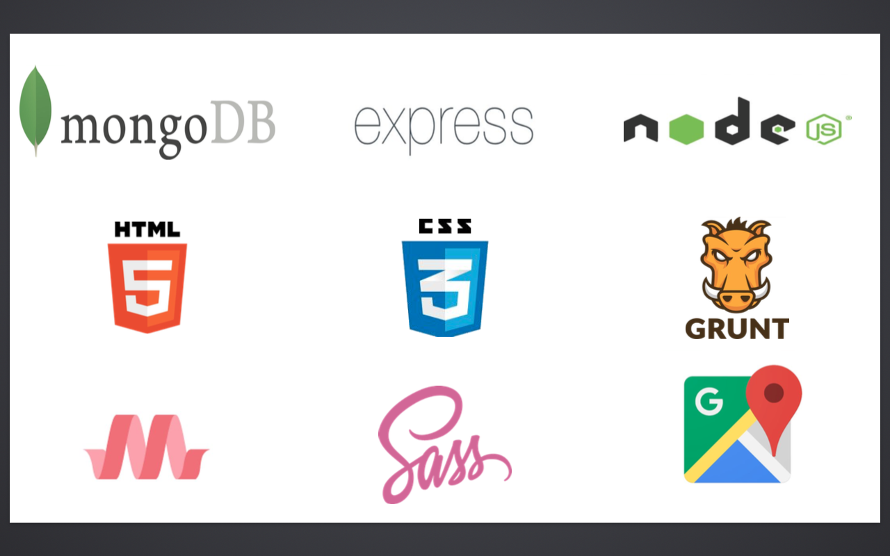

Please visit the link above to view the site, or scroll down to view the details.

##The Approach/How it works
When a you visit Unicorn you are greeted with a welcome screen

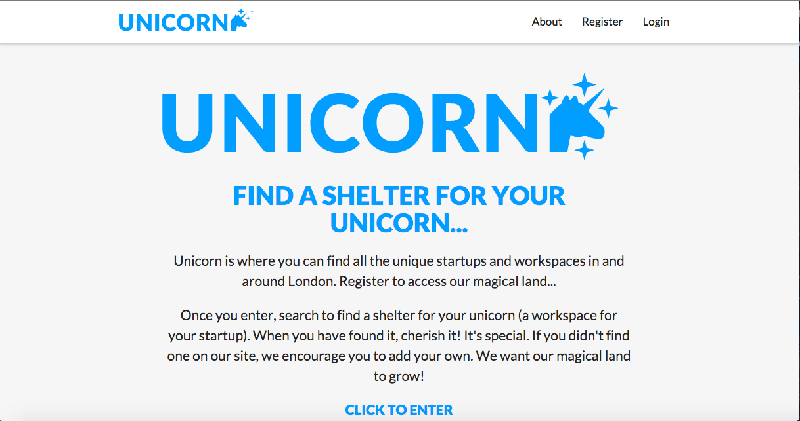

You must register/login

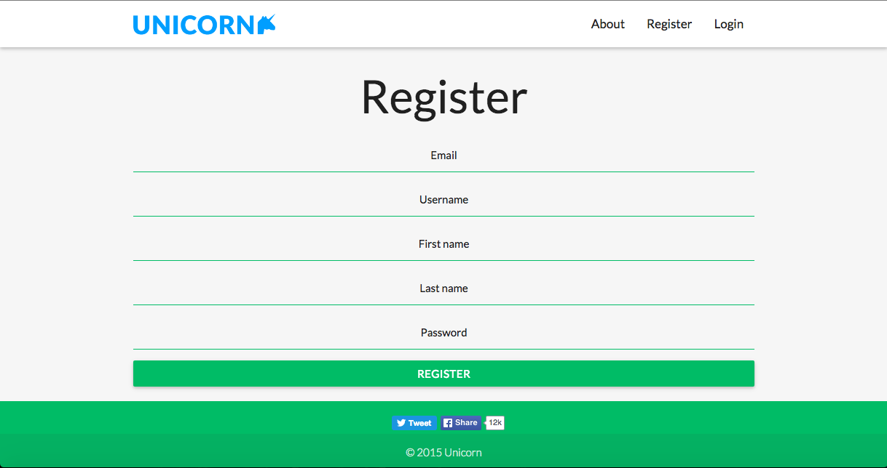

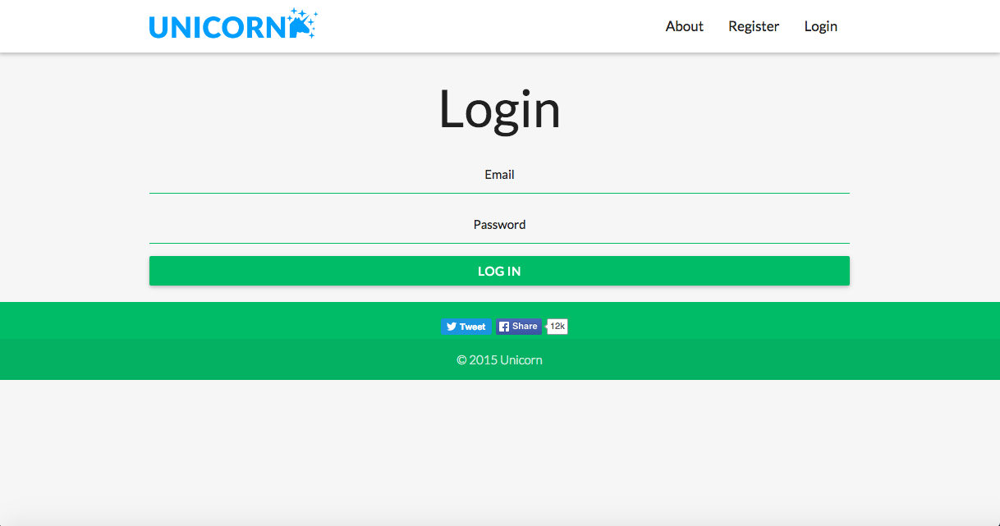

Once you are loggedin you are greeted with all the startups and workspaces.

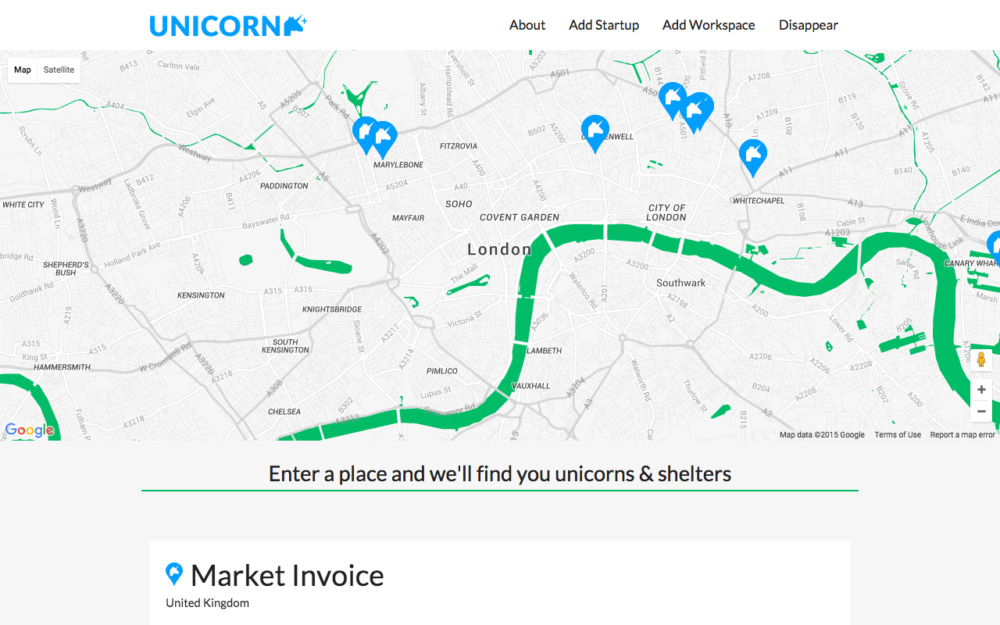

You can then search for specific workspaces or startups.

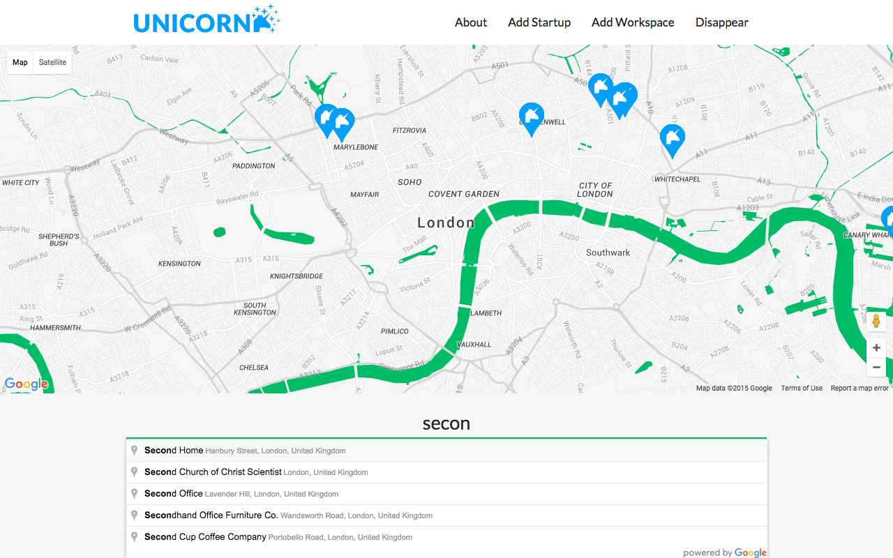

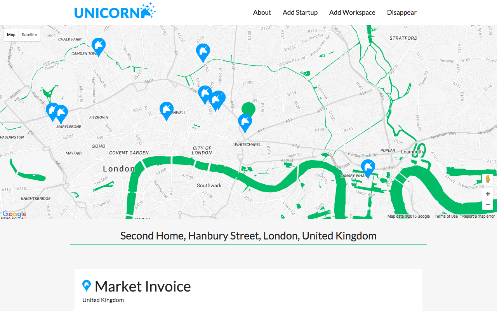

Or you can search by location.

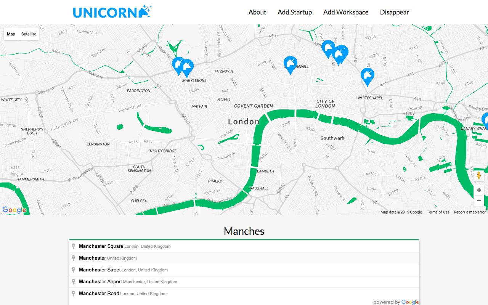

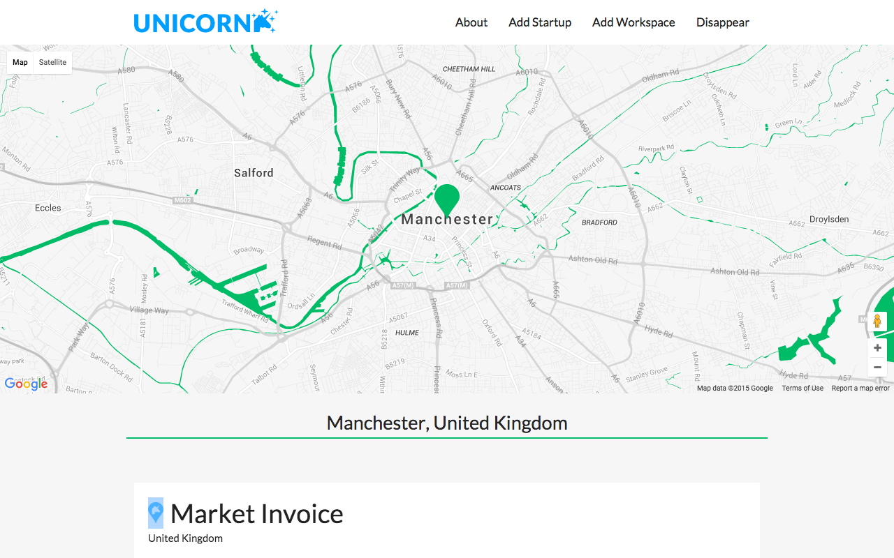

If a user cannot find a workspace or start up they can add one.

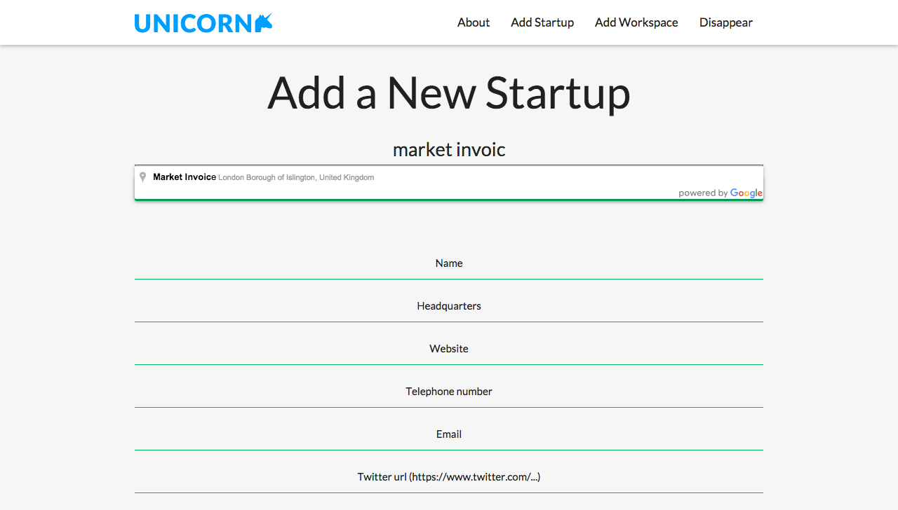

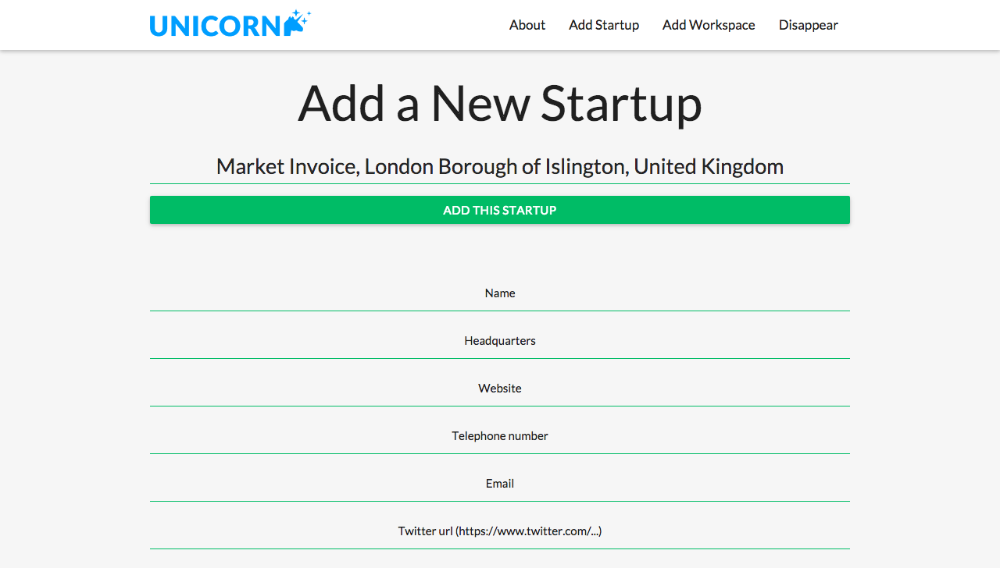

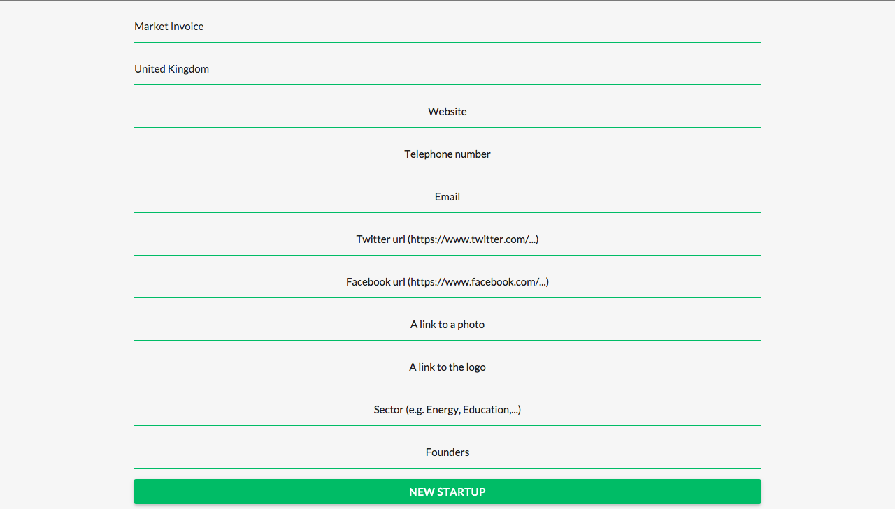

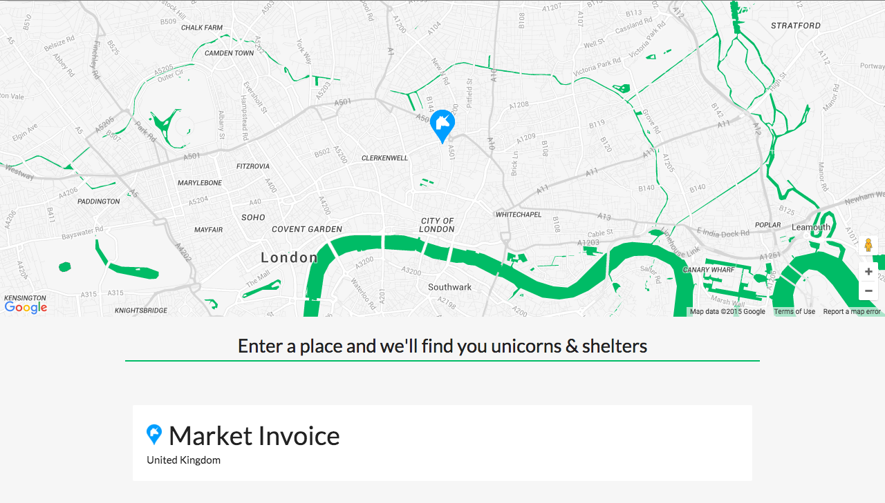

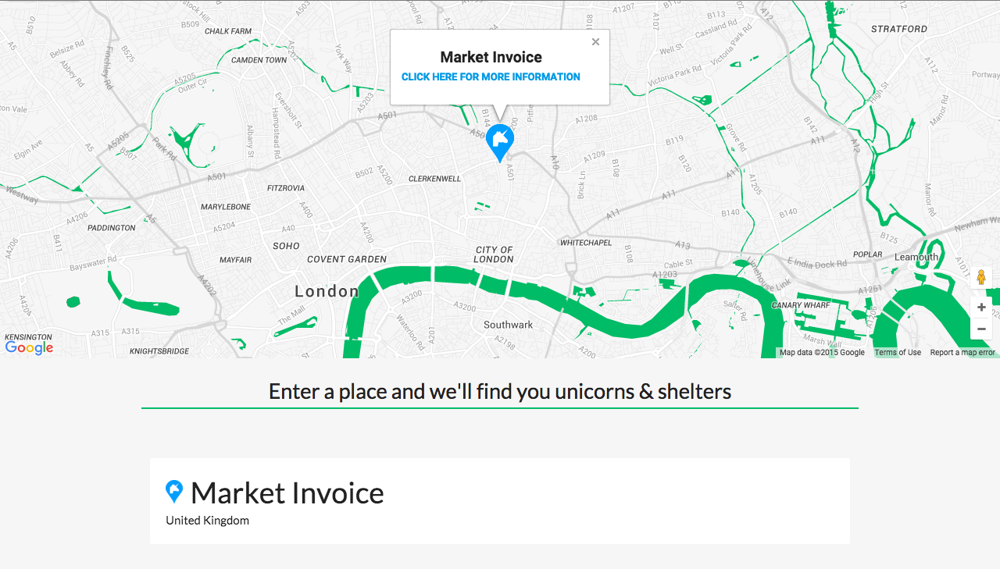

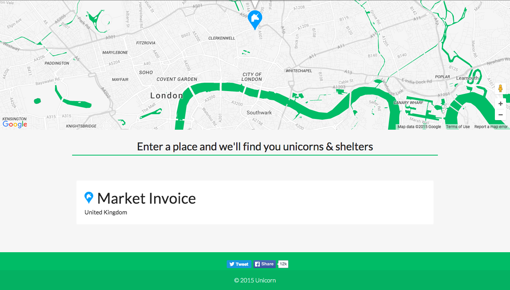                      

##The Challenges

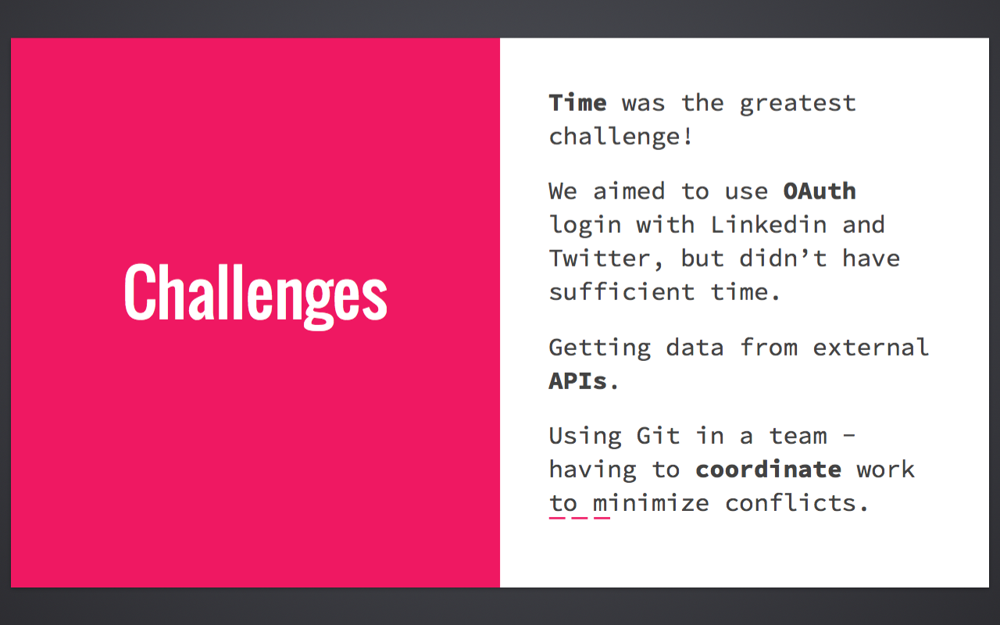

##The Wins
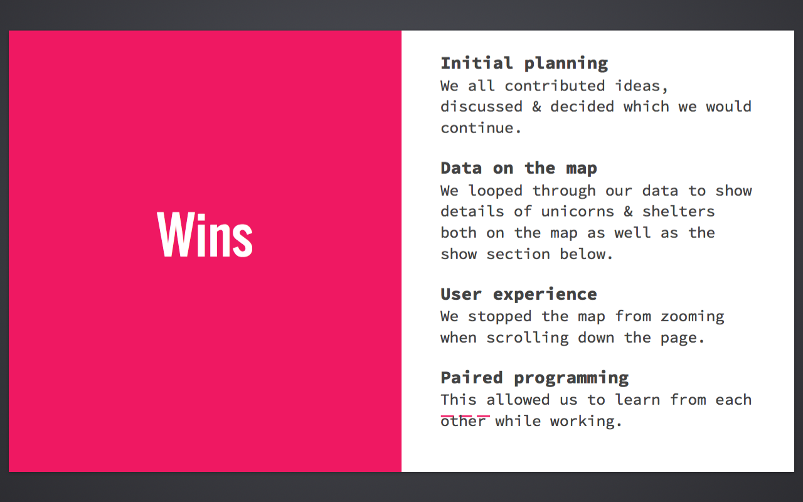

 

